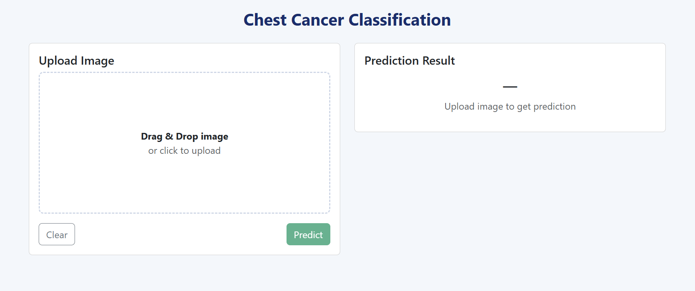

# End-to-End Chest Cancer Classification using CNN, MLflow, and DVC

## Project Overview

This project implements an end-to-end deep learning pipeline for **chest cancer classification** using Convolutional Neural Networks (CNNs). The system is designed to automatically classify medical images as **Adenocarcinoma** or **Normal**.



The pipeline follows production-oriented ML best practices, covering:

* Data ingestion and validation
* Image preprocessing
* Model training and evaluation
* Experiment tracking
* Reproducible pipelines

The goal is to provide a clean, modular, and reproducible ML workflow suitable for research, experimentation, and future production deployment.

---

## Key Features

* CNN-based image classification model
* Modular and scalable project structure
* Fully automated ML pipeline
* Experiment tracking with MLflow
* Data and pipeline versioning with DVC
* Configuration-driven workflow (YAML-based configs)

---

## Project Workflow

The project follows a structured pipeline-oriented workflow:

1. Update `config.yaml`
2. Update `params.yaml`
3. Update entity definitions
4. Update the configuration manager (`src/config`)
5. Implement/update pipeline components
6. Update pipeline orchestration logic
7. Update `main.py`
8. Update `dvc.yaml`

Each step is modular, making the system easy to maintain and extend.

---

## MLflow

MLflow is used for experiment tracking and model management.

### Capabilities

* Track experiments and metrics
* Log parameters, artifacts, and models
* Compare multiple experiment runs

### Resources

* [MLflow Documentation](https://mlflow.org/docs/latest/index.html)
* [MLflow Tutorial Playlist](https://youtube.com/playlist?list=PLkz_y24mlSJZrqiZ4_cLUiP0CBN5wFmTb)

### Run MLflow UI (Windows)

Start the MLflow tracking UI using PowerShell:

```powershell
mlflow ui
```

### Remote Tracking (DagsHub) – Windows

This project supports remote MLflow tracking using DagsHub.

Set environment variables using **PowerShell**:

```powershell
setx MLFLOW_TRACKING_URI "<your_tracking_uri>"
setx MLFLOW_TRACKING_USERNAME "<your_username>"
setx MLFLOW_TRACKING_PASSWORD "<your_token>"
```

> Restart the terminal after setting environment variables.

Run the training pipeline:

```powershell
python main.py
```

---

## DVC (Data Version Control)

DVC is used for data versioning and pipeline orchestration.

### Common Commands (Windows)

Run the following commands from the project root directory using PowerShell:

````powershell
dvc init
dvc repro
dvc dag
````

### Why DVC?

* Lightweight and Git-friendly
* Tracks datasets and model artifacts
* Enables reproducible ML pipelines
* Visualizes pipeline dependencies

---

## MLflow vs DVC

### MLflow

* Production-grade experiment tracking
* Centralized logging of metrics and artifacts
* Model registry support

### DVC

* Lightweight experiment and data versioning
* Pipeline orchestration
* Ideal for proof-of-concept and research workflows

---

## Tech Stack

* Python
* TensorFlow / Keras
* MLflow
* DVC
* OpenCV / Pillow
* YAML-based configuration

---

## Future Improvements

* Model performance optimization
* Hyperparameter tuning
* Advanced evaluation metrics
* API-based inference service
* CI/CD integration

---

## Author

Developed as a hands-on deep learning and MLOps project focusing on reproducibility, experimentation, and clean engineering practices.
